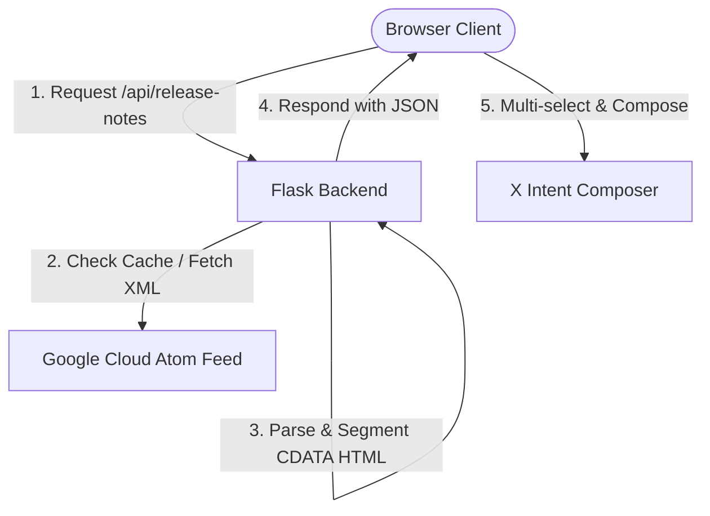

# BigQuery Release Explorer 🚀

A premium, modern web application to track, filter, and share Google Cloud BigQuery release notes. Built with a **Python Flask** backend and a responsive **glassmorphic dark-theme** frontend utilizing vanilla HTML, CSS, and JavaScript.


## Features

- 🔄 **Real-Time Synchronization**: Pulls live release updates directly from the official Google Cloud BigQuery Atom feed.
- 📦 **Granular Categorization**: Segments daily aggregated logs into individual change items labeled by update type (*Feature*, *Change*, *Issue*, *Deprecation*).
- 🔍 **Local Search & Filters**: Instant full-text search and category filtering with checkable badges.
- 📬 **X (Twitter) Custom Composer**:
  - Multi-select capability to share single or aggregated updates.
  - Interactive composition window mimicking X/Twitter with live character limiting (280 characters).
  - SVG-based circular progress ring representing character consumption.
- 🛡️ **Robust Caching**: 10-minute in-memory caching system to minimize external API latency and rate-limiting.
- 🔗 **Direct References**: Quick sharing via date anchors and clipboard copying support.

---

## System Architecture



---

## File Structure

```text
bq-release-notes/
├── app.py                 # Flask server, feed retriever, and XML/regex parser
├── requirements.txt       # Python package requirements
├── .gitignore             # Standard git exclusions (.venv, caches, etc.)
├── README.md              # Project documentation
├── templates/
│   └── index.html         # Main semantic HTML structure
└── static/
    ├── css/
    │   └── styles.css     # Premium dark theme and glassmorphism styling
    └── js/
        └── main.js        # Feed rendering, filter operations, and Twitter composer
```

---

## Getting Started

### Prerequisites
- Python 3.8 or higher installed on your system.
- Git (optional, for version control).

### Installation
1. Clone this repository or download the source code:
   ```bash
   git clone https://github.com/vaibhav11patil/antigravity-event-talks-app.git
   cd antigravity-event-talks-app
   ```

2. (Optional) Create and activate a virtual environment:
   ```bash
   python3 -m venv venv
   source venv/bin/activate  # On Windows: venv\Scripts\activate
   ```

3. Install the required dependencies:
   ```bash
   pip install -r requirements.txt
   ```

4. Launch the application server:
   ```bash
   python3 app.py
   ```

5. Open your web browser and navigate to **`http://localhost:5000`**.

---

## Usage Guide
1. **Refresh Feed**: Click the **Refresh Feed** button at the top right to force a reload bypassing the local 10-minute cache.
2. **Search & Filter**: Type keywords in the search bar or toggle the checkable category chips to filter updates instantly.
3. **Sharing**:
   - Click the **Copy Link** action on any card to copy the direct link.
   - Click the **Tweet** button on any card to post it directly.
   - Select multiple cards using the checkmarks on the left, click **Compose Tweet** in the bottom floating bar, customize your content in the composing popup, and click **Post to X** to share.

---

## License
Distributed under the MIT License. See `LICENSE` for more information.
